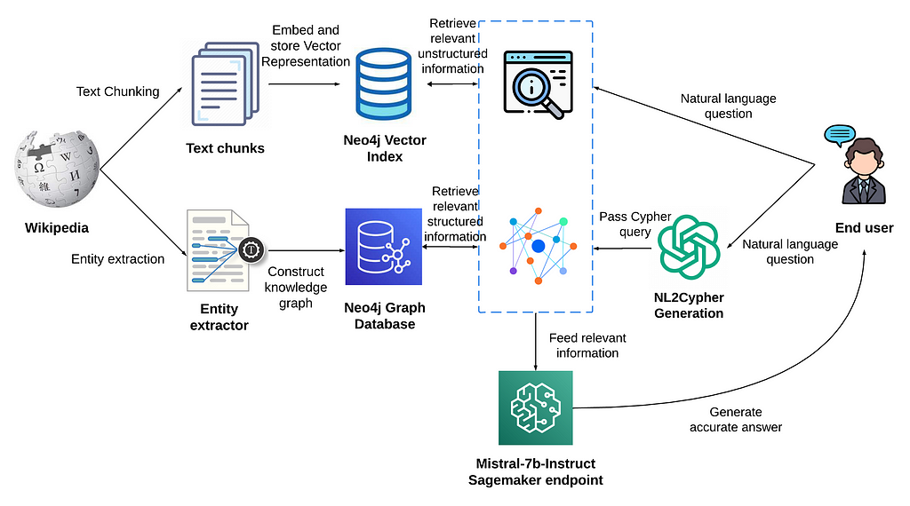

# Neo4j Graph-RAG Question Answering

This project builds a **question-answering system over a Neo4j graph database** using **LangChain, Groq’s Llama-3.3-70B model, and GraphCypherQAChain**.

You load a movie knowledge graph from a CSV, create nodes and relationships in Neo4j, and then let the LLM generate Cypher queries automatically from natural language.

It turns plain questions like:

- “Who directed the movie Casino?”
- “Who acted in Casino?”
- “How many movies has Tom Hanks acted in?”
- “List all genres of Schindler’s List”

into Cypher, runs them on Neo4j, and answers in text.

---
## Working Architecture

 

---

## 🔥 What this project demonstrates

✔ Graph-based question answering  
✔ Natural-language to Cypher generation  
✔ Automated schema inspection  
✔ A movie knowledge graph built from scratch  
✔ Groq inference with Llama-3.3-70B  
✔ LangChain’s `GraphCypherQAChain`  

This is a hands-on example of how **LLMs + Neo4j = structured reasoning over graph data**.

---

## 🧱 Tech Stack

- **Neo4j Graph Database**
- **LangChain**
- **GraphCypherQAChain**
- **Groq (Llama-3.3-70B-Versatile)**
- **Python**
- **dotenv for secrets**

---

## 📂 Project Files

- `experiments.ipynb` – Loading dataset, building graph, querying with LLM
- `promptstrategies.ipynb` – Few-shot examples, prompt engineering, schema prompts
- `.env` – Neo4j and Groq credentials
- `requirements.txt` – Python dependencies

### Packages in requirements:
- neo4j==5.26
- langchain
- langchain_community
- langchain_openai
- langchain_groq
- python-dotenv
